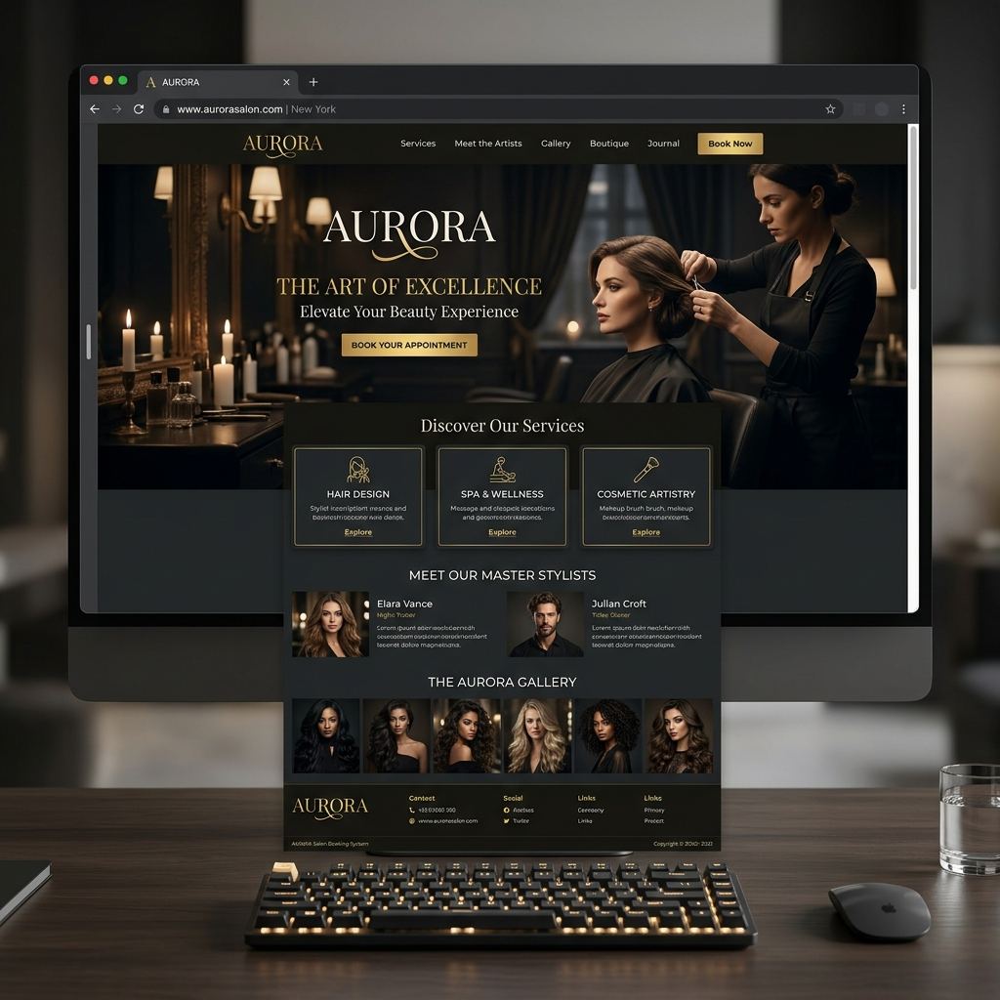
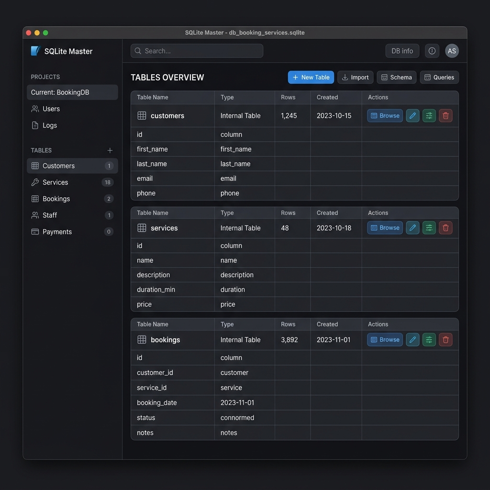
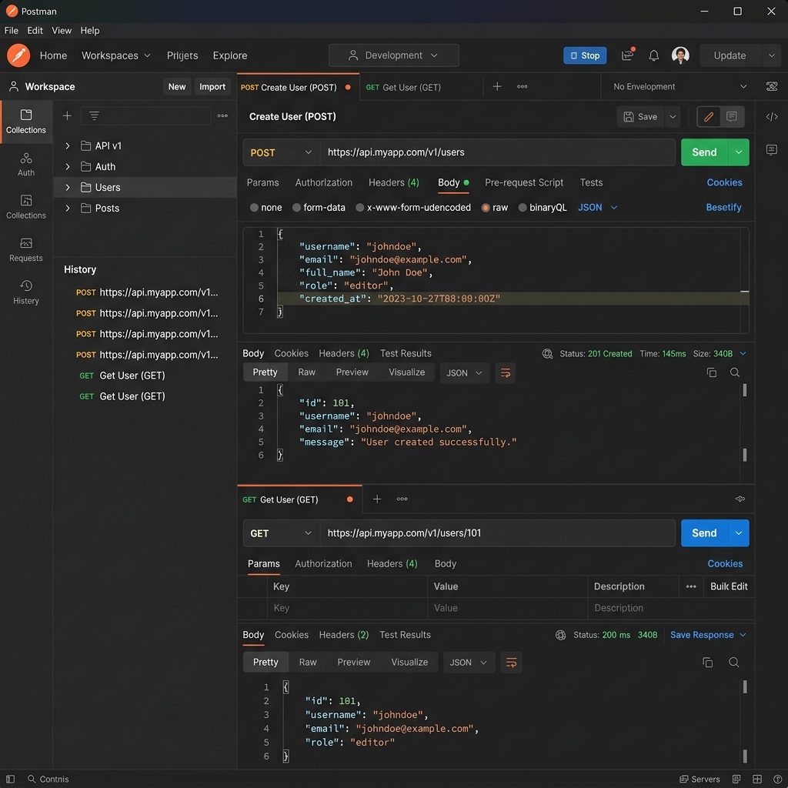

# Salon & Spa Booking System

Glow & Ease is a luxury, responsive web application for salon and spa booking. It integrates a lightweight Django REST API backend with a high-fidelity glassmorphic HTML/CSS/JS frontend, using SQLite to securely manage customer profiles, stylists availability, booking requests, and payments.

---

## 🚀 Getting Started

### 1. Requirements
Ensure Python 3.x and Django are installed on your machine:
```bash
pip install django django-cors-headers djangorestframework
```

### 2. Running the Django API Backend
Navigate to the `Backend` directory and start the server:
```bash
cd SalonSpaBookingSystem/Backend
python manage.py runserver 8000
```
*The server will boot on `http://127.0.0.1:8000`.*

### 3. Running the Frontend
Double-click [index.html](file:///c:/Users/geeth/OneDrive/Documents/New%20folder%20(5)/SalonSpaBookingSystem/Frontend/index.html) or run a local HTTP server inside the `Frontend` directory to view the app in your browser.

---

## 📂 Project Architecture

```
SalonSpaBookingSystem/
├── Backend/
│   ├── db.py          # SQLite custom schema and CRUD helpers
│   ├── views.py       # DRF Function-Based API Views
│   ├── urls.py        # Django URL pattern routes
│   ├── settings.py    # Django CORS, Auth and standard configurations
│   ├── wsgi.py        # WSGI deployment hook
│   └── manage.py      # Django administration script
└── Frontend/
    ├── index.html     # Brand Homepage
    ├── login.html     # Auth Page (Admin & Customer checks)
    ├── register.html  # Customer account signup
    ├── services.html  # Dynamic catalog with category filtering
    ├── stylists.html  # Stylists experience profiles and indicators
    ├── booking.html   # Scheduler form & checkout summary
    ├── payment.html   # Securing checkout transactions
    ├── customer_dashboard.html # Personalized appointment ledger
    ├── admin_dashboard.html    # Enterprise control dashboard (CRUD logs)
    ├── style.css      # Premium dark glassmorphism system
    ├── script.js       # Central API Fetch engine
    └── images/        # Assets folder
```

---

## 🎨 Visual Preview

### 1. Browser Landing Page & Hero Section
The brand homepage features sleek micro-animations, interactive styling cards, and expert practitioner availability.


### 2. SQLite Database Schema
Structured using 5 clean database entities with pre-seeded mockup items:
- `customers` (customer_id, full_name, email, phone, gender, password)
- `services` (service_id, service_name, category, duration, price, description)
- `stylists` (stylist_id, stylist_name, specialization, experience, phone, availability)
- `appointments` (appointment_id, customer_name, stylist_name, service_name, date, time, total, status)
- `payments` (payment_id, customer_name, appointment_id, amount, method, status, date)



### 3. Postman API Testing REST Framework
The backend exposes 20 REST API CRUD endpoints (GET, POST, PUT, DELETE) verified using Postman:

